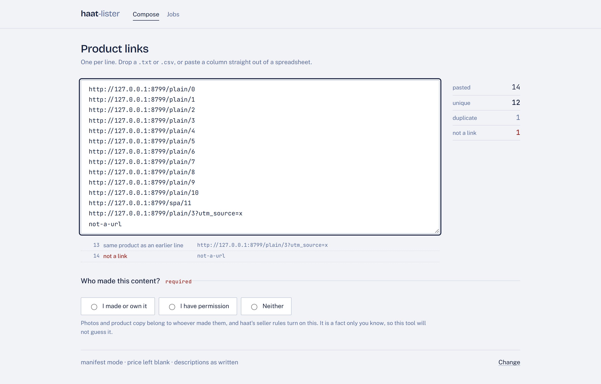
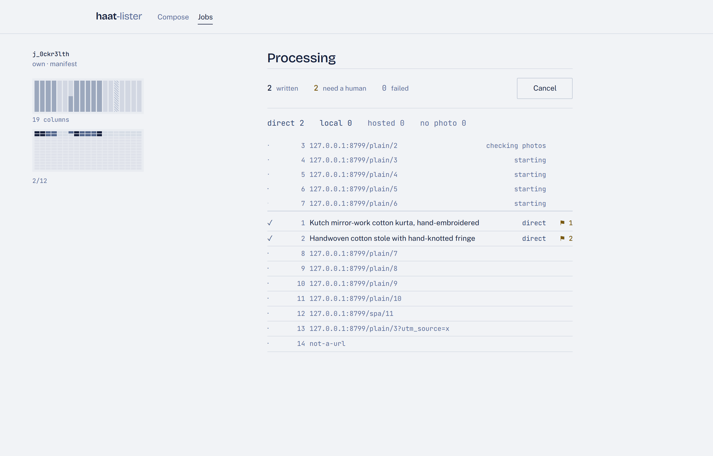
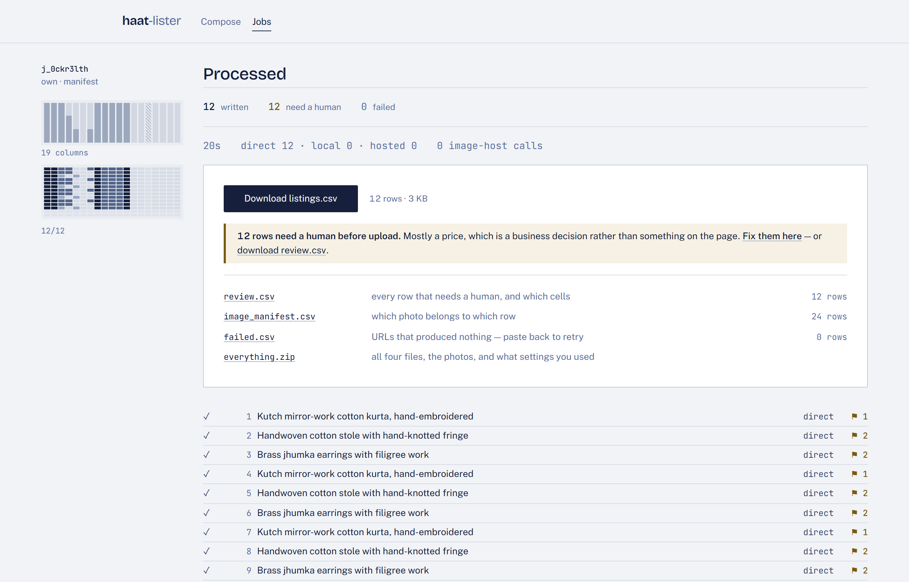
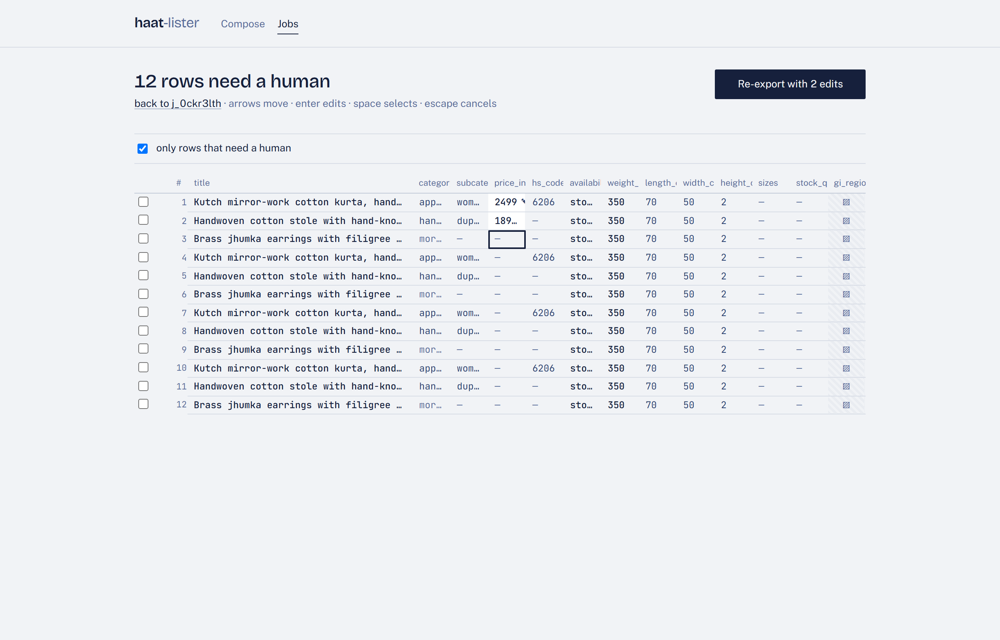

# haat-lister

Turns product page URLs into a haat bulk-listing CSV — honestly.

Point it at your own catalogue, get back `listings.csv` in haat's exact 19-column
format, the product photos as files ready to upload, and a worklist telling you
which rows still need a human and why.

There is a command line and a local web console. They run the same code.

The design assumption throughout is that **a blank cell you can see is worth more
than a plausible value you can't check.** Nothing here guesses a price, a weight,
a dimension, an HS code or a GI region.

---

## What this tool is for

Moving **your own** catalogue onto haat. A seller with two hundred products on
their own storefront, or on a marketplace they already sell through, who does
not want to retype them.

That constraint is not a formality. haat's seller rules require products made in
India by the seller and prohibit resold or dropshipped goods; product
photographs and marketing copy belong to whoever created them. So this tool will
happily read any product page you point it at — and a listing built from someone
else's page will not survive haat's own review, however clean the CSV is. That
is why `--provenance` is required and has no default: whether you made the thing
is a fact only you know, and it is the one question the tool refuses to answer
for you.

If you are pointing it at a page you do not own to see what it does, that is
fine. Just know which of those two things you are doing before you paste five
hundred links.

---

## Five minutes from clone to CSV

```bash
python -m venv .venv
.venv/Scripts/activate          # Windows;  source .venv/bin/activate elsewhere
pip install -e .

cp .env.example .env            # then set HAAT_CONTACT to an address you read
haat-lister serve
```

That opens `http://127.0.0.1:8000`. Paste product links, say who made them, press
one button, download the CSV. No terminal needed after that first command.

Four screens:

| | |
|---|---|
| **Compose** | paste links, choose provenance, run |
| **Sheet** | `runs/master.csv` — everything every finished job produced, deduped |
| **Jobs** | what you have run, and its files |
| **Find photos** | every photo for every product, *before* committing to a run |

**Find photos** is the one worth knowing about. Paste a catalogue or upload a
CSV — it detects which column holds the links and carries your SKU column
through — and it tells you which products have a usable photo, which are too
small, and which shops refuse us. It writes nothing, publishes nothing, and
never contacts an image host, so it costs you a look and nothing else. What it
learns is cached, so the real run afterwards does not re-fetch the same shops.

### The two CSVs

haat's import template is nineteen columns and none of them is an image, so
every run produces two files:

```
listings.csv               19 columns  →  upload this to haat
listings_with_images.csv   + every photo URL, size, and method  →  for your records
```

They are written from the same rows in the same order, and a test asserts they
line up. The same pair accumulates as `master.csv` and `master_with_images.csv`.

The console ships **built**, so a machine with no Node still runs it. `config-check`
runs on the page and tells you what is missing before you spend a request.

---

## The console

### Paste links



Duplicates and malformed lines are marked **in place**, with line numbers, so
they can be fixed without leaving the screen. `plain/3?utm_source=x` is
recognised as the same product as `plain/3` and fetched once.

**Provenance has no default.** The run cannot start until you say who made the
content, with a sentence explaining why it is being asked. Settings collapse to
one line — `manifest mode · price left blank · descriptions as written`.

### Watch it work



The rail is the **fill grid**: 19 columns wide, one per CSV column, filling cell
by cell as rows land. Each cell is shaded by how deeply that field is dyed —
full depth for a value read from JSON-LD, mid-vat for one inferred, pale for one
nobody could find. `gi_region` is hatched, because it is locked rather than
empty.

Read it and you already know what you will have to fix: `price_inr` is a pale
stripe, `title` is solid. The profile above it stays legible at any number of
rows, which the per-row grid stops being past a few hundred.

The stages are real transitions, not a timer — `checking photos` means the image
pipeline is running. The tier counts are Rule 1's economics live: `direct 2 ·
local 0 · hosted 0`.

### Take the file



One primary action. Everything else quiet beneath it, sized in rows rather than
kilobytes. If anything needs a human it says so in brass and offers to fix it
here.

### Fix what needs fixing



Arrows move, Enter edits, Enter commits and drops one row in the same column —
because filling a column is what actually happens. Space selects; a selection
can be bulk-set in one request. An edited cell sits on white and remembers what
the page said.

`gi_region` is hatched and refuses focus, so the keyboard skips it rather than
stopping on a cell that can never be filled.

**Edits never overwrite the extraction.** They are stored beside it and applied
on the way out, so removing one restores what the page said, and six weeks later
"did we scrape this or did I type it?" has an answer.

---

## The command line

```bash
haat-lister config-check                       # costs nothing; run it first
haat-lister single URL --provenance own --dry-run
haat-lister batch urls.txt --provenance own
haat-lister batch urls.txt --provenance own --job j_7fk2m9qa --resume
haat-lister validate-only urls.txt             # Tier 1 sweep, zero downloads
haat-lister review                             # re-emit review.csv from the ledger
haat-lister serve                              # the console
```

Ctrl-C stops a batch cleanly and commits everything finished; `--resume` picks up
without re-fetching a page.

### Options worth knowing

```
--provenance own|authorised|third-party    required, no default
--images manifest|url_columns|both         default manifest (files, not URLs)
--render / --no-render                     Stage B browser fallback
--llm                                      model-assisted rewrite + category choice
--concurrency N                            rows in flight across the batch
--resume                                   skip what this job already completed
--dry-run / --json                         report only / the full record
-v / -vv                                   info / debug
--log-file PATH                            one JSON line per URL, credentials redacted
```

---

## What a job leaves behind

```
runs/j_7fk2m9qa/
├── listings.csv          the import file. 19 columns, rows in the order you pasted
├── review.csv            every row that needs a human, and which cells
├── image_manifest.csv    which photo belongs to which row. The first is the hero
├── failed.csv            URLs that produced nothing. Its URL column re-runs as a job
├── images/<row_key>/     the photos, normalised and ready to upload
└── job.json              the exact settings this used
```

**Every URL you paste ends up in exactly one of those files.** Not usually — it
is asserted at the end of every job, including after a cancel, and a job that
cannot say where a URL went refuses to call itself done.

The goal you should be able to meet: clear `review.csv` **without reopening a
single source page** — except for price, which is a business decision nobody can
scrape.

---

## The two rules

Everything else in this codebase is detail. These two are the design.

### Rule 1 — images: try the free thing first, always

Every row's own image URL is tested against nine predicates before anything is
downloaded or uploaded. If it survives, that URL is used and **no bytes move**.
Only a URL *proven* to fail can reach a paid image host.

```
Tier 1   validate the source's direct URL          every row, always
Tier 2a  download                                  only if Tier 1 failed, or files are wanted
Tier 2b  normalise (resize, strip EXIF, re-encode)
Tier 2c  upload to a host                          only if Tier 1 failed AND a URL is needed
Tier 2d  re-validate what the host gave back       through the same nine predicates
```

The gate is literal code, not a convention:

```python
do_download = need_file or (need_url and not tier1_passed)
do_upload   = need_url and not tier1_passed
assert not (do_upload and tier1_passed)
```

The predicates run cheapest-first — syntax, reputation cache and signed-URL
detection all **before any network call**, so a rejection from a CDN you already
know blocks hotlinking costs nothing:

1. syntax · 8. signed/expiring URL · 9. host reputation · 2. reachable ·
3. redirect sanity · 4. content-type · 5. size floor · 6. decodable + dimensions ·
7. **hotlink test** — fetched without a `Referer`, the way a buyer's browser
   would load it from a haat listing.

Predicate 7 is the one that matters. A URL that works when you paste it in your
browser and 403s for a buyer is the commonest way a marketplace listing ends up
with a broken photo.

In the default `manifest` mode there is no image-host object at all, so `--images
manifest` doesn't mean "don't call a host" — there is nothing to call. That is
the right mode for haat, whose uploader takes files.

### Rule 2 — provenance: the tool will not assume it

Required, with no default, on the command line and in the console.

| Value | Effect |
|---|---|
| `own` | You made or own this content. Normal operation. |
| `authorised` | You have the rights holder's permission. Normal operation. |
| `third-party` | Neither. Every row is forced to `needs_review`, images are **never** re-hosted, and descriptions are forced through a rewrite. |

Product photographs and marketing copy belong to whoever created them. Which of
those applies is a fact only you know — and re-uploading photographs you don't
own would be this tool making a copy of someone else's work on your behalf.

---

## What this tool will not do

Stated plainly so you know what you're getting, and so the next person to work on
this doesn't add it:

- **No anti-bot evasion.** No CAPTCHA solving, no paywall bypass, no fingerprint
  spoofing, no proxy rotation, no stealth plugins, no `navigator.webdriver`
  patching. If a site blocks us, that is an answer: the row fails loudly and says
  which URL and why.
- **It identifies itself honestly.** One real, contactable User-Agent with your
  email in it, used by both httpx and Chromium.
- **It respects `robots.txt` by default,** one request per origin per run. A
  401/403 on `robots.txt` is read as *disallowed* — a site that won't show its
  rules hasn't granted anything. `--ignore-robots` exists, defaults off, warns.
- **It is polite by default.** One request at a time per host, ~2s apart with
  jitter. `--concurrency 5` is a budget across the batch, never five simultaneous
  hits on one shop. A site's own `Crawl-delay` wins when longer; a shorter one
  never speeds us up.
- **It will not fetch from your own network.** Loopback, private ranges,
  link-local and the cloud metadata endpoint are refused — **on every redirect
  hop**, because a guard that only checks the URL you typed is decorative. The
  escape hatch is a list of hostnames in config, never a switch, and never
  settable from a request.
- **`gi_region` is always blank.** A GI tag is an Indian government certification
  and haat makes it a seller declaration. The internal record has no such field,
  the writer emits a constant, and the API refuses to set it. Three barriers, so
  removing one doesn't open it.
- **Money and customs fields are never silently guessed.** `price_inr` is blank
  by policy by default. HS codes are clearly-labelled suggestions, never facts.

### The one thing it does not stop

**DNS rebinding.** The SSRF guard resolves a hostname and checks the addresses;
httpx resolves again when it opens the socket, and a hostile resolver can answer
differently. Closing that needs a custom transport. It doesn't matter on
loopback, and `serve --host 0.0.0.0` says so before it starts.

---

## How a page becomes a row

```
robots.txt  →  Stage A (httpx, ~200ms)  →  extract  →  [plugin]
                        ↓ only if something's missing a browser could supply
                Stage B (Chromium, ~3s) →  extract  →  [plugin]  →  merge
                        ↓
                enrich (category, HS suggestion, FX, policy screen)
                        ↓
                [--llm]  →  images (Rule 1)  →  policy defaults  →  provenance gate  →  ledger
                        ↓
                listings.csv, in the order you pasted
```

**Stage B runs only for incomplete records** — missing title, description or
image candidates. Deliberately not for missing price, weight or dimensions:
those are absent from most source pages full stop, so paying three seconds a row
to confirm that would be the most expensive possible way to learn nothing.

Where the two stages disagree, a rendered value wins only if the static one was
empty or less trustworthy. **On a tie the static value stands** — a rendered DOM
is also where recommendation carousels live.

---

## The ledger is the source of truth

`store/ledger.db` holds every row, tagged with the position you pasted it at.
The CSV is a **projection** of it.

That one decision resolves a conflict that otherwise has no answer — rows must
come out in input order, and the file must be written incrementally so a job
that dies at #480 doesn't lose 480 rows. Rows commit to SQLite the instant they
finish; a watermark writer appends in index order, buffering only rendered lines.

The consequence worth noticing: **the file on disk is always a correctly ordered
prefix.** Never a hole, never a row out of place. That is what makes "download
what's done so far" an honest offer, what makes a mid-job page refresh free, and
what makes a re-export after edits the same operation rather than a second one.

---

## Plugins

For shops the generic path gets wrong. A plugin runs **last and its values win**
— that's the point of writing one. The safeguard isn't restraint, it's
accountability: every field it supplies is stamped `source=plugin`, so
`review.csv` names exactly which cells came from where.

```yaml
extraction:
  plugins_dir: "my_plugins"     # your Python; only read when non-empty
```

```python
from haat_lister.extract.plugins import PluginContext, PluginResult, register
from haat_lister.models import Confidence, FieldSource, FieldValue

class MyShop:
    name = "my_shop"

    def matches(self, url: str, html: str) -> bool:
        return "myshop.example" in url      # keep cheap: runs on every page

    def extract(self, ctx: PluginContext) -> PluginResult:
        result = PluginResult()
        if node := ctx.dom.css_first(".product-weight"):
            result.fields["weight_g"] = FieldValue.found(
                int(node.text(strip=True).removesuffix("g")),
                FieldSource.PLUGIN, Confidence.HIGH,
            )
        return result

register(MyShop())
```

`haat_lister/extract/plugins/example_shopify.py` is a full worked example: it
recovers Shopify's real variant price from the theme's JavaScript and the full
gallery from a slider that renders one `` — both without a browser.

A plugin **cannot** write `gi_region`, claim a value came from JSON-LD, clear a
row's status, or exempt an image from Tier 1.

---

## The `--llm` layer

Optional, opt-in per run, deliberately narrow. It **rewrites a description** in
the seller's own words, and **chooses a category from `taxonomy.yaml`** when
keyword matching fell through — a choice from a closed list, never an invention.

It cannot write a price, weight, dimension, HS code, GI region, availability or
stock count — not because the prompt says so (though it does) but because
`RewriteResult` has no field to put one in. A model returning `{"price_inr":
2499}` isn't rejected; there is nowhere for it to land.

Rewrites are re-screened against the policy vocabulary, so a GI claim the source
never made is flagged. Responses are cached in the ledger by prompt hash.

---

## Try it without touching a real shop

```bash
python demo/shop.py                                  # terminal 1
# config.yaml → fetch.allow_private_hosts: ["127.0.0.1"]
haat-lister serve                                    # terminal 2
```

`demo/shop.py` serves three deliberately awkward kinds of page: clean JSON-LD, a
React shell with nothing in the HTML, and one whose images 403 anyone without a
`Referer`. `demo/urls.txt` covers all three plus a duplicate and a malformed
line.

Step two is needed because the SSRF guard refuses loopback by default — this
tool fetches URLs typed by whoever can reach it, so `127.0.0.1` is exactly the
address it should not follow without being told to.

---

## Configuration

`config.yaml` is commented throughout and is the durable default; CLI flags
override it for one run. Lines marked `# OPERATOR:` need your attention, and
`config-check` lists every one still unset.

The three you're most likely to touch:

- **`taxonomy.yaml`** — haat's category and subcategory slugs. Entries marked
  `derived: true` were inferred from haat's slug convention rather than read from
  real haat data. **Verify them with one test import before a large run**; a
  wrong slug either rejects the import or files your listing where nobody finds it.
- **`price.strategy`** — `blank` (default), `convert`, or `markup`. Blank because
  haat wants the maker's INR price, which is a business decision, not the scraped
  retail price of some other shop.
- **`hs_codes`** — ships nearly empty on purpose. An HS code is a customs
  declaration; until you have an authoritative list, rows carry a labelled
  suggestion rather than a fact.

---

## Development

```bash
pip install -e ".[dev]"
pytest                       # ~520 tests
ruff check . && mypy haat_lister

cd web && npm install && npm run build     # the console
python web/audit.py  http://127.0.0.1:8131 # axe + keyboard + reduced motion
python web/e2e.py    http://127.0.0.1:8131 # paste → run → download → verify bytes
```

The tests that matter most assert things *didn't* happen —
`test_image_pipeline_gate.py` counts host calls and downloads,
`test_fetch_stages.py` asserts no browser process was launched,
`test_job_output.py` asserts no URL went missing, `test_security.py` sweeps §10
clause by clause. If you change the image pipeline or the Stage B gate, those
files will tell you whether you broke the economics.

`web/audit.py` and `web/e2e.py` are runnable, not aspirational: axe-core comes
from `node_modules`, and the E2E checks the downloaded header byte-for-byte
against `haat-bulk-listings-template.csv`.

---

## Still open

Three things need you, and none of them block a first run:

- **A test import into haat.** The CSV matches the template byte-for-byte, but
  "the importer accepts it" is the one claim nobody here has verified. One row
  would settle it — and would settle the derived slugs at the same time.
- **The made-to-order availability value.** `fields.availability_made_to_order_value`
  is unset, so those rows go out blank and flagged.
- **An authoritative HS-code list.** Two entries ship; everything else gets a
  labelled suggestion.
